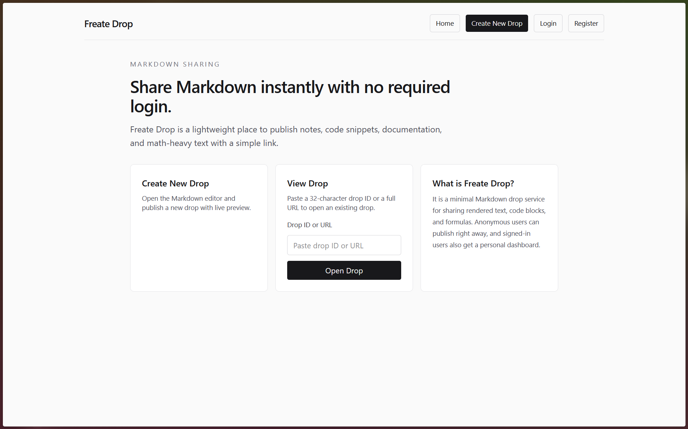
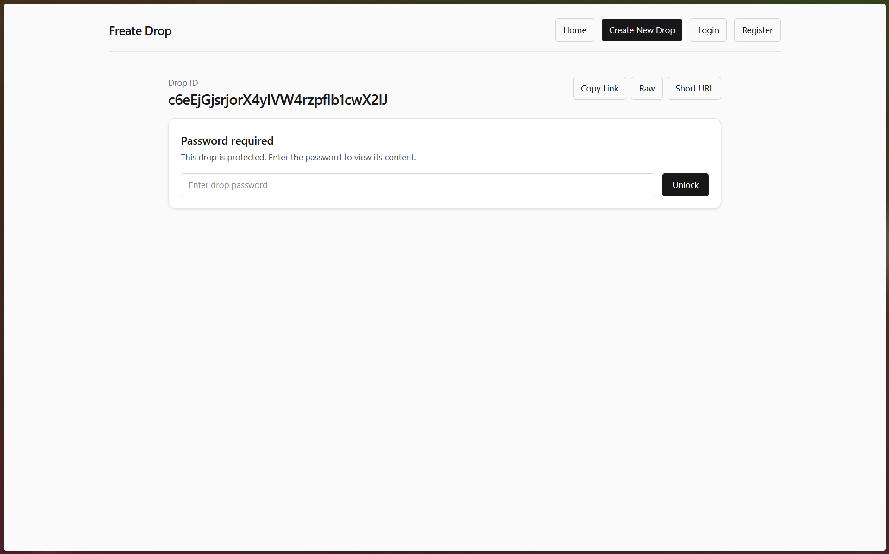
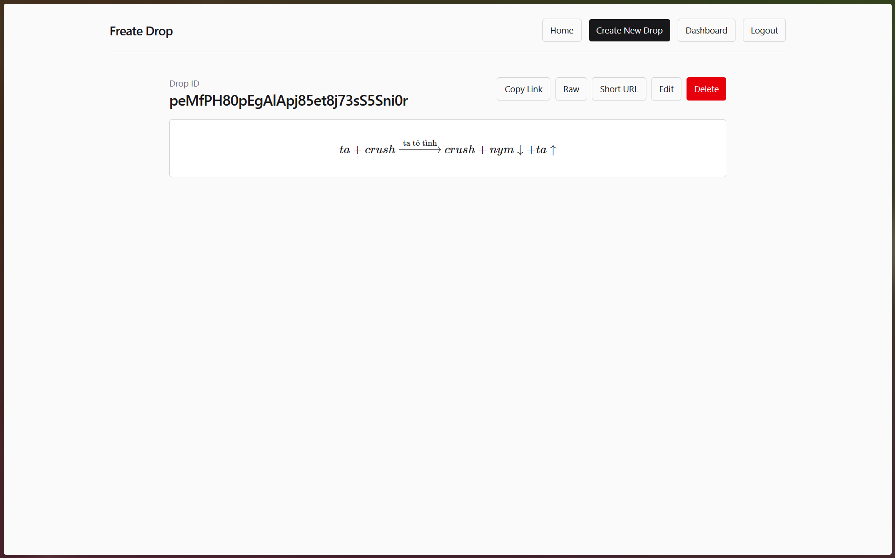

# Freate Drop

Freate Drop is a full-stack Django web application for sharing Markdown content without requiring login. Users can publish anonymous drops, manage them with encrypted edit-token cookies, or sign in to manage account-owned drops from a dashboard.

## Features

- Publish Markdown drops with 32-character alphanumeric IDs
- Live Markdown preview using CDN-loaded `marked`
- Syntax highlighting with `highlight.js`
- Math rendering with KaTeX and MathJax
- Anonymous edit/delete via HttpOnly token cookie
- Logged-in user ownership and dashboard management
- 8-character short URLs with `/s/<code>/` redirects
- Raw Markdown endpoint at `/<drop_id>/raw`
- SQLite by default, configurable for PostgreSQL or MariaDB via environment variables

## Verified dependency versions

### Python packages

- Django `6.0.6`
- django-cors-headers `4.9.0`
- cryptography `48.0.0`
- djangorestframework `3.17.1`

### Frontend CDN libraries

- TailwindCSS browser CDN: `https://cdn.jsdelivr.net/npm/@tailwindcss/browser@4`
- marked `18.0.5`: `https://cdn.jsdelivr.net/npm/marked@18.0.5/lib/marked.umd.js`
- highlight.js `11.11.1`:
  - CSS: `https://cdn.jsdelivr.net/gh/highlightjs/cdn-release@11.11.1/build/styles/default.min.css`
  - JS: `https://cdn.jsdelivr.net/gh/highlightjs/cdn-release@11.11.1/build/highlight.min.js`
- KaTeX `0.17.0`:
  - CSS: `https://cdn.jsdelivr.net/npm/katex@0.17.0/dist/katex.min.css`
  - JS: `https://cdn.jsdelivr.net/npm/katex@0.17.0/dist/katex.min.js`
  - Auto-render: `https://cdn.jsdelivr.net/npm/katex@0.17.0/dist/contrib/auto-render.min.js`
- MathJax v4 latest 4.x component: `https://cdn.jsdelivr.net/npm/mathjax@4/tex-mml-chtml.js`

## Setup

1. Create a virtual environment:

```bash
python3 -m venv .venv
source .venv/bin/activate
```

2. Install dependencies:

```bash
pip install -r requirements.txt
```

3. Copy environment settings:

```bash
cp .env.example .env
```

4. Generate a Fernet encryption key:

```bash
python -c "from cryptography.fernet import Fernet; print(Fernet.generate_key().decode())"
```

5. Export environment variables from `.env` manually or through your shell.

6. Run migrations:

```bash
python manage.py migrate
```

7. Optionally create an admin user:

```bash
python manage.py createsuperuser
```

8. Start the development server:

```bash
python manage.py runserver
```

9. Open the URL shown in the terminal, usually `http://127.0.0.1:8000/`.

## Environment variables

- `SECRET_KEY`: Django secret key
- `DEBUG`: `True` or `False`
- `ENCRYPTION_KEY`: Fernet key for edit-token encryption
- `ALLOWED_HOSTS`: comma-separated hostnames
- `DATABASE_ENGINE`: `sqlite`, `postgresql`, or `mariadb`
- `DATABASE_NAME`: database name or SQLite filename
- `DATABASE_USER`: database username for PostgreSQL/MariaDB
- `DATABASE_PASSWORD`: database password for PostgreSQL/MariaDB
- `DATABASE_HOST`: database host for PostgreSQL/MariaDB
- `DATABASE_PORT`: database port for PostgreSQL/MariaDB

## Notes

- Anonymous drops use an HttpOnly cookie named `drop_token_<drop_id>` for edit/delete authorization.
- Logged-in users can manage their own drops even without the cookie.
- Short URLs are generated lazily the first time a user clicks the shorten button.

## Images



